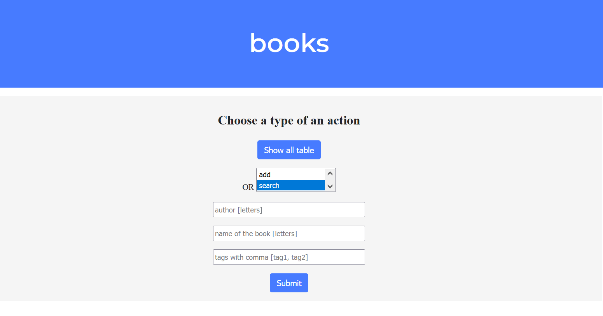
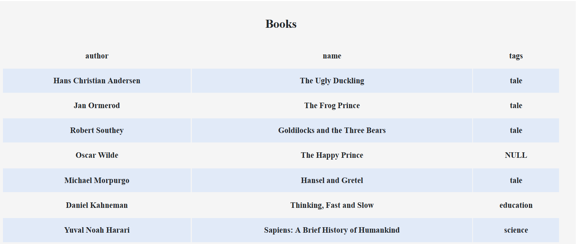

## Books Keeper

## Description

(in the process)

Flask app which allows users to register and save their lists of books in the table with columns "author", "title", "tags" for searching required data later. Each user can have their own table (educational project for small amount of users)

The app keeps records of the books in a sqlite db.

Searching goes with regexp functionality and case insensitive.

User's emails and passwords are checked, passwords are kept in a hashed form.

